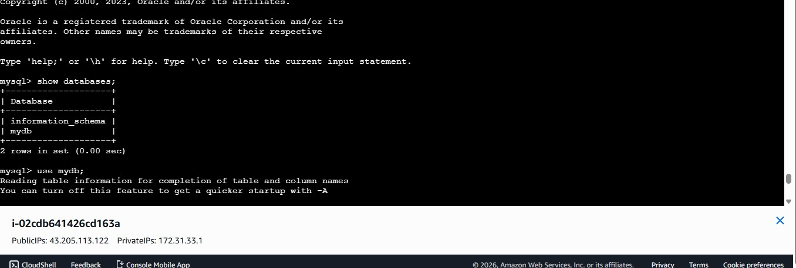

# Docker Projects

This repository contains hands-on **Docker and DevOps projects** designed to demonstrate containerization, CI/CD automation, and real-world deployment scenarios on AWS.

---

## 📌 Projects Overview

### 🔹 Frotended |  |

A containerized single-tier Node.js application deployed using Docker.

**Key Highlights:**

- Dockerized Node.js application using Alpine base image
- Optimized Dockerfile with layer caching
- Exposed application over custom port
- Deployed and tested on AWS EC2

**Tech Stack:**

- Docker
- Node.js
- AWS EC2
- Linux

---

### 🔹 Docker Compose Multi-Service Application

A multi-container application orchestrated using Docker Compose.

**Key Highlights:**

- Multi-service deployment using Docker Compose
- Automated metrics extraction
- Monitoring logs stored in CSV format

**Tech Stack:**

- Docker Compose
- Docker
- Linux

---

### 🔹 CI/CD Automation with Jenkins

Implemented CI/CD pipelines for Docker-based applications.

**Key Highlights:**

- Automated build and deployment pipeline
- Docker image build triggered via Jenkins
- Improved deployment consistency

**Tech Stack:**

- Jenkins
- Docker
- GitHub

---

## 🚀 How to Run the Single-Tier App

```bash
# Build Docker image
docker build -t node-app .

# Run container
docker run -d -p 8000:8000 node-app
```

Access the application:

```
http://<EC2-Public-IP>:8000
```

---

## 📸 Screenshots

| Description | Screenshot |
|-------------|------------|
| Database |  |
| Database Message |  |

---

## 🧠 Learning Outcomes

- Practical experience with Docker and containerization
- Understanding of single-tier and multi-tier application architecture
- CI/CD automation using Jenkins
- Deployment and troubleshooting on AWS EC2

---

## 👤 Author

**Junaid Tyagi**\
DevOps / Cloud Engineer

---

## 📌 Notes

This repository is created for **learning and portfolio purposes** and reflects real-world DevOps practices.

